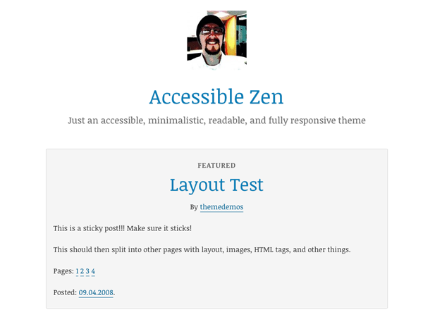

Accessibility is hard. It shouldn't have to be.

That's why I'm proud to release [Accessible Zen](/projects/accessible-zen/), an accessible, minimalistic, readable and fully responsive [WordPress](http://wordpress.org/) theme. Inspired by Leo Babauta's [Zen Habits theme](http://zenhabits.net/theme/), Accessible Zen puts the focus on your content and nothing else, plus it has plenty of WordPress goodness built right in.

<mark>Read more about <a href="/projects/accessible-zen/">Accessible Zen</a>, <a href="https://github.com/davidakennedy/accessible-zen">download the alpha version</a> or <a href="http://accessiblezen.davidakennedy.com">view the demo</a>.</mark>

## The Inspiration

I love reading Zen Habits, and admire how Leo has captured that _zen_ feeling in the design of his site. It served as the inspiration for Accessible Zen, both in appearance and name.

Being a former journalist, I also enjoy watching the evolution of media, the web and blogging. More and more of the bloggers I read daily have made a move toward simplicity. [Jeffrey Zeldman](http://www.zeldman.com/), [Matt Gemmell](http://mattgemmell.com/), [Chris Coyier](http://chriscoyier.net/), [Matt Mullenweg](http://ma.tt/) and others have all unveiled more content-focused designs recently. Maintaining that movement of simplicity in Accessible Zen was important.

And of course, I wanted to create the theme with accessibility in mind from the very beginning. I've carefully crafted the theme to adhere to Section 508 and WCAG 2.0, Level AA standards so any blogger can have a beautiful and accessible site.

### An Alpha Release

**Just so you know…** This is an Alpha release. That means it's early in the game. I'm still developing the theme and I really don’t recommend that you run it on a production site — set up a test site just to play with it.

_I may change the theme significantly before its official release._

Once the theme hits a stable release, I'll submit it to the [WordPress theme repository](http://wordpress.org/themes/).

I'd love to hear what you think! You can submit feedback on the [GitHub issues section](https://github.com/davidakennedy/Accessible-Zen/issues), or by emailing me at <me@davidakennedy.com>.

### Check It Out

I'm building another accessible theme as well with [the Cities project](/blog/joining-the-cities-project/). Also, I plan to create a blog series on what I've learned throughout this process. Be sure to follow my blog to keep up with my accessible theming posts!

I hope you enjoy the theme as much as I enjoy(ed) making it! Remember, accessibility is more about people than technology. Anyone can make the web more accessible. [Start learning how at WebAIM](http://webaim.org/).

<mark>Read more about <a href="/projects/accessible-zen/">Accessible Zen</a>, <a href="https://github.com/davidakennedy/accessible-zen">download the alpha version</a> or <a href="http://accessiblezen.davidakennedy.com">view the demo</a>.</mark>
