I attended my first Grand Meetup at Automattic last week. I [recently joined](/blog/joining-automattic/), so the first day of the meetup was also my official first day at Automattic.

I had a blast and met a lot of Automatticians, something that's extra special in a remote company during the first week of work. 🙂 I loved working on projects with new teammates and listening to a variety of Flash talks by my new colleagues. Flash talk topics included professional wrestling, Yo-yo-ing, Data Centers, My Guitars and many more.

I did make one rookie mistake though: I forgot my DSLR camera, a Canon 20D. So the gallery below is a few shots from my iPhone 5 camera.

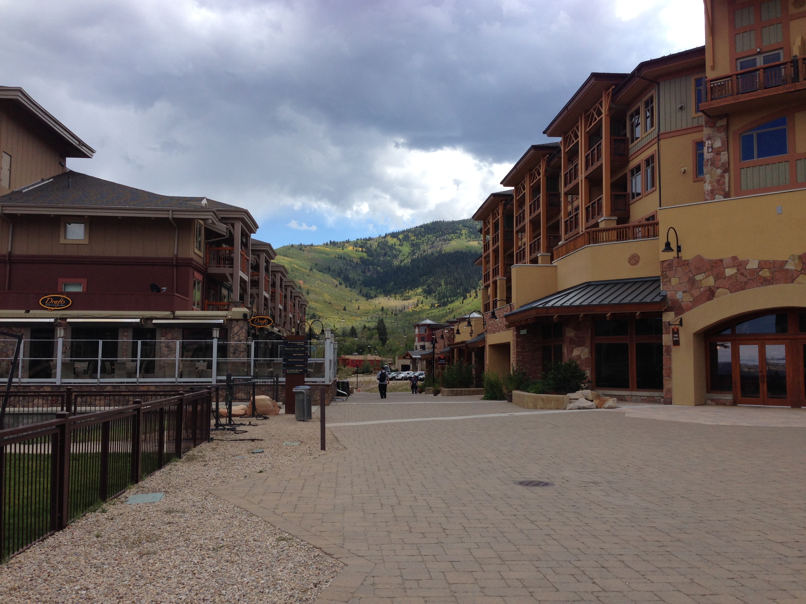

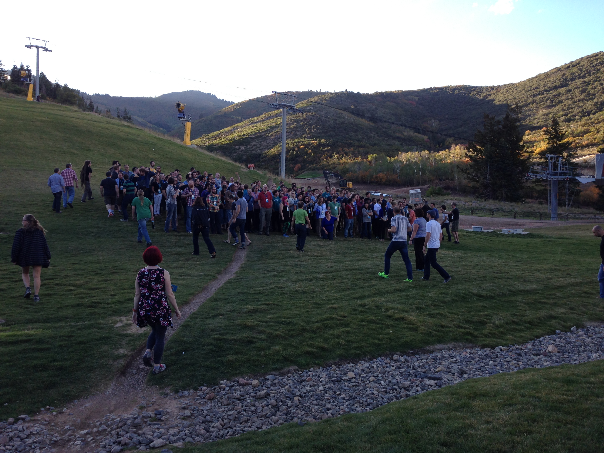

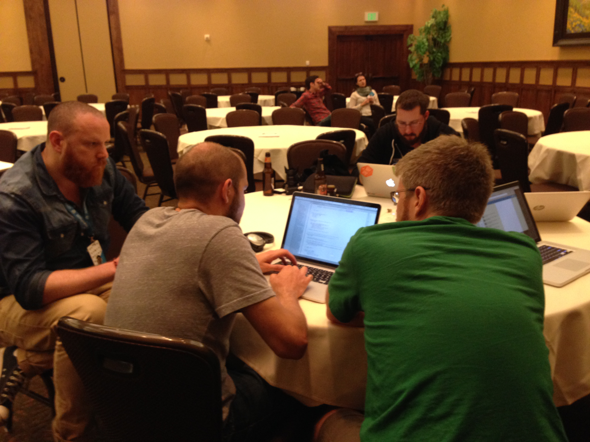

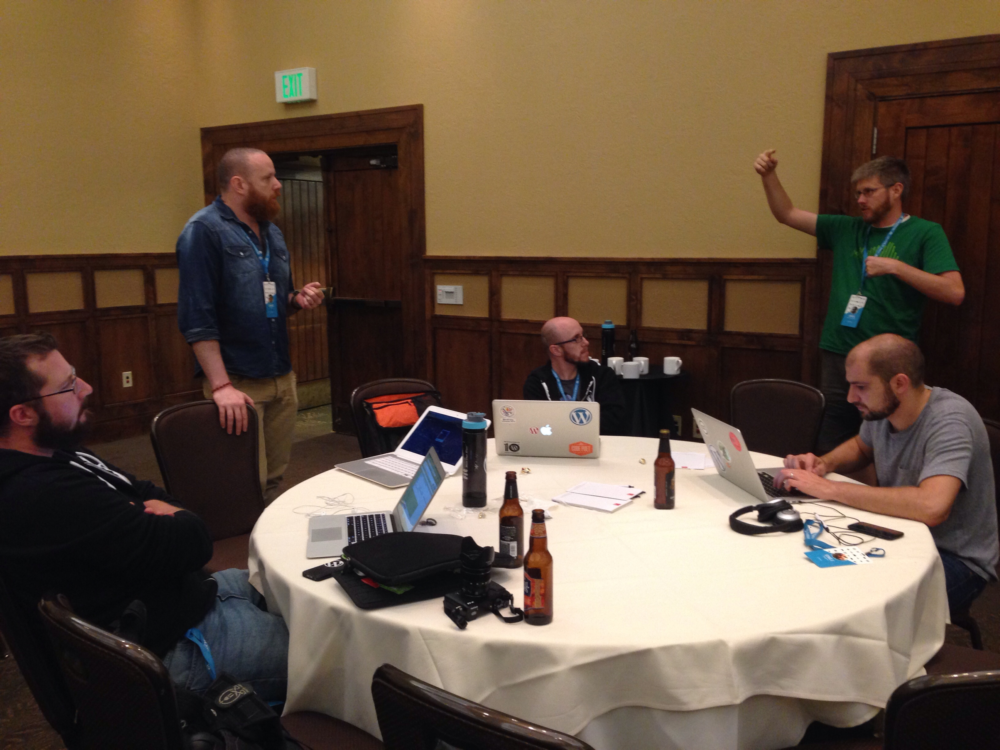

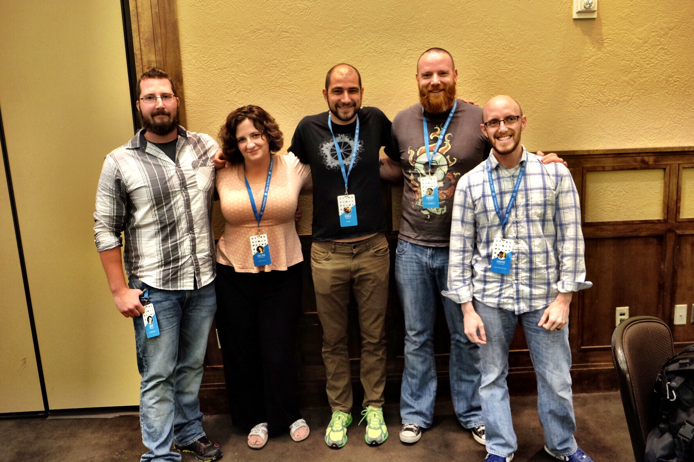

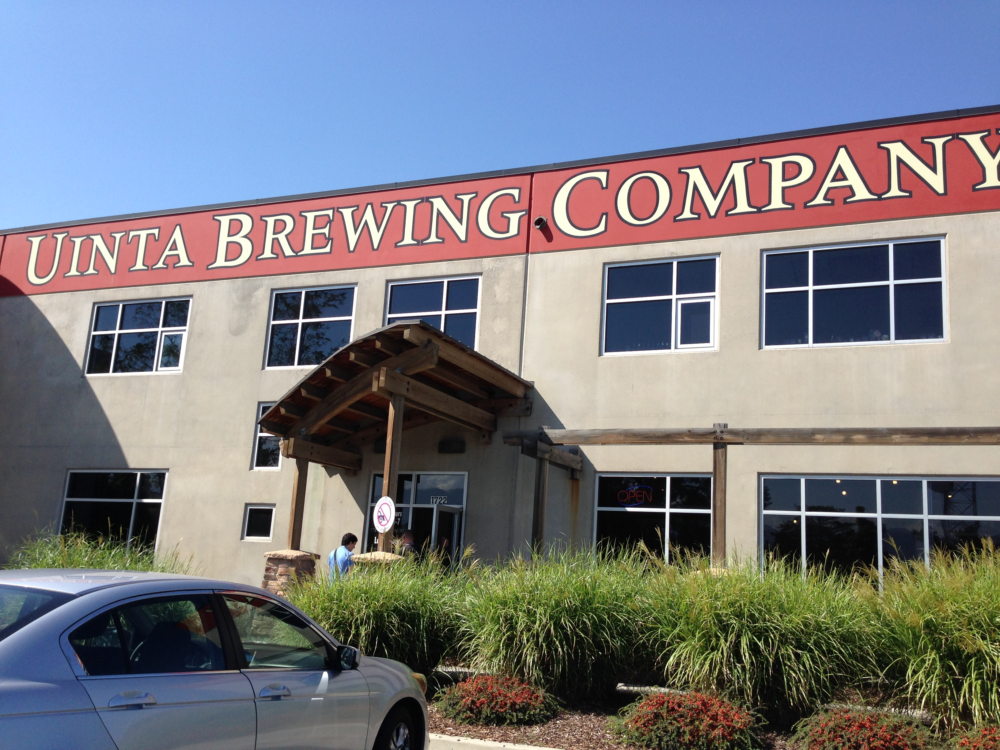

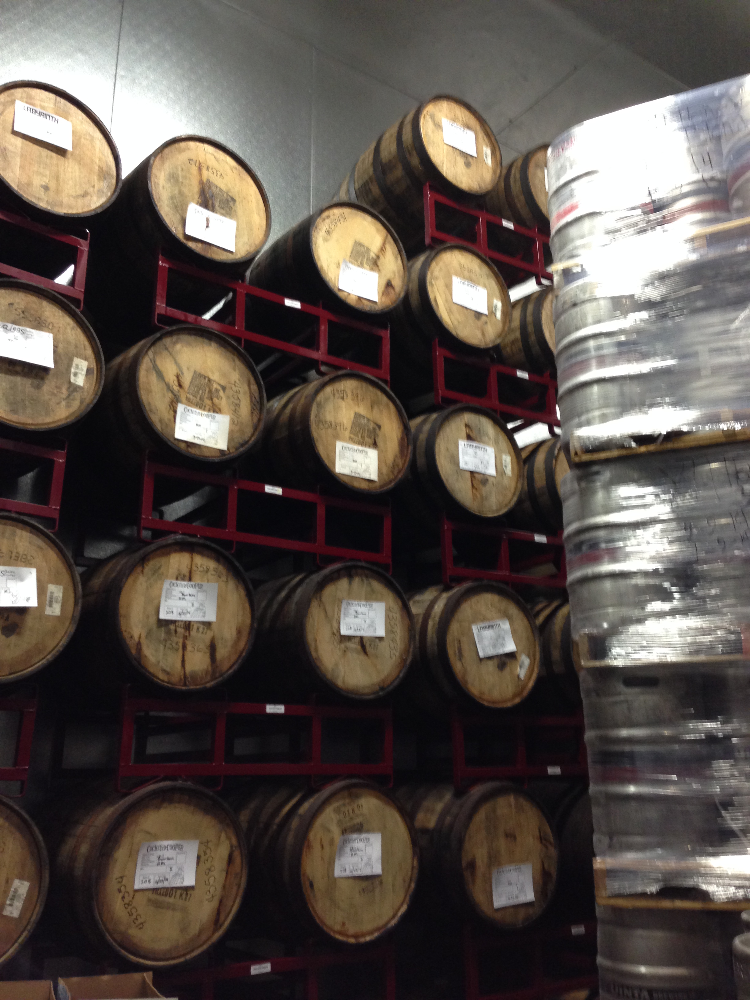

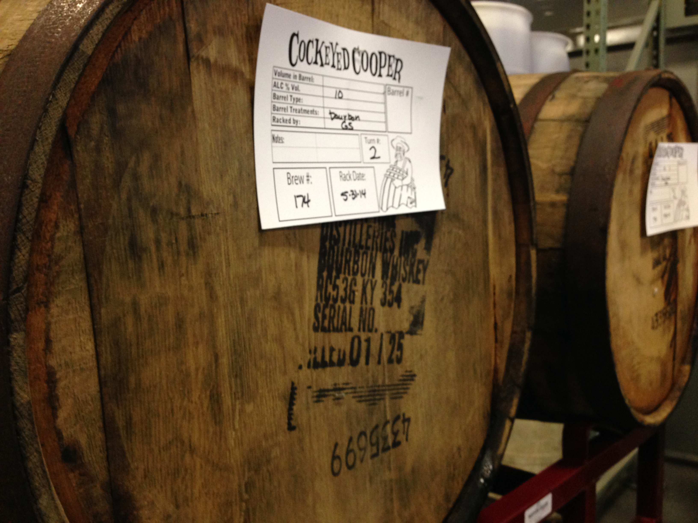

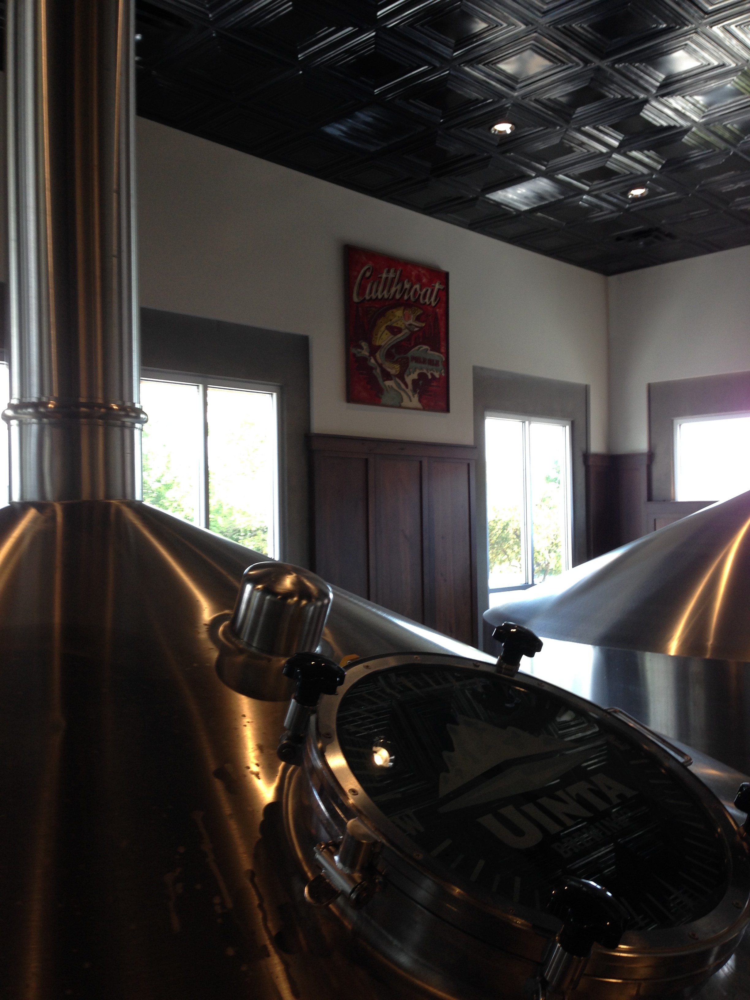

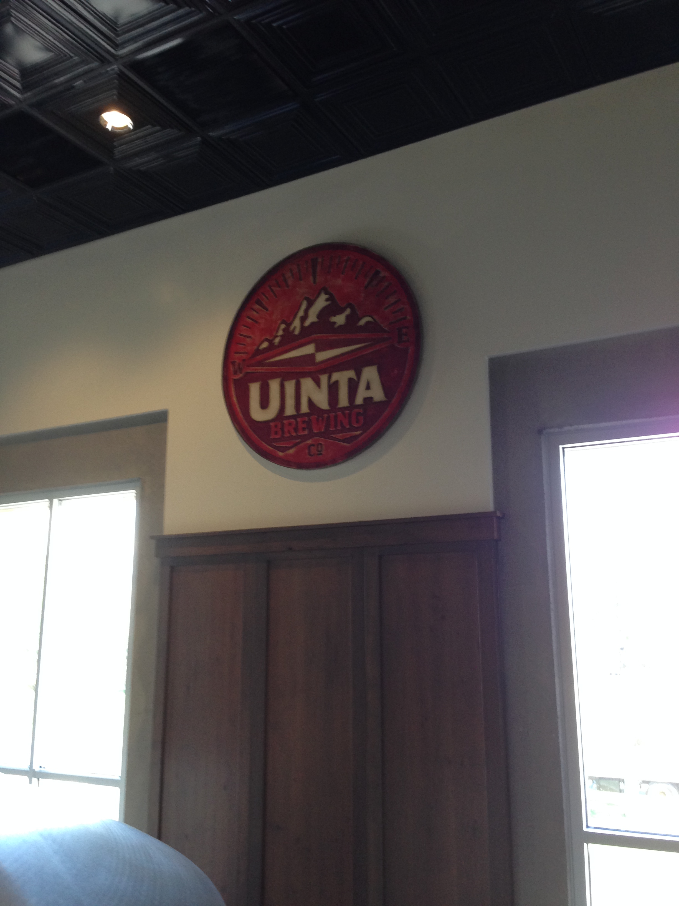

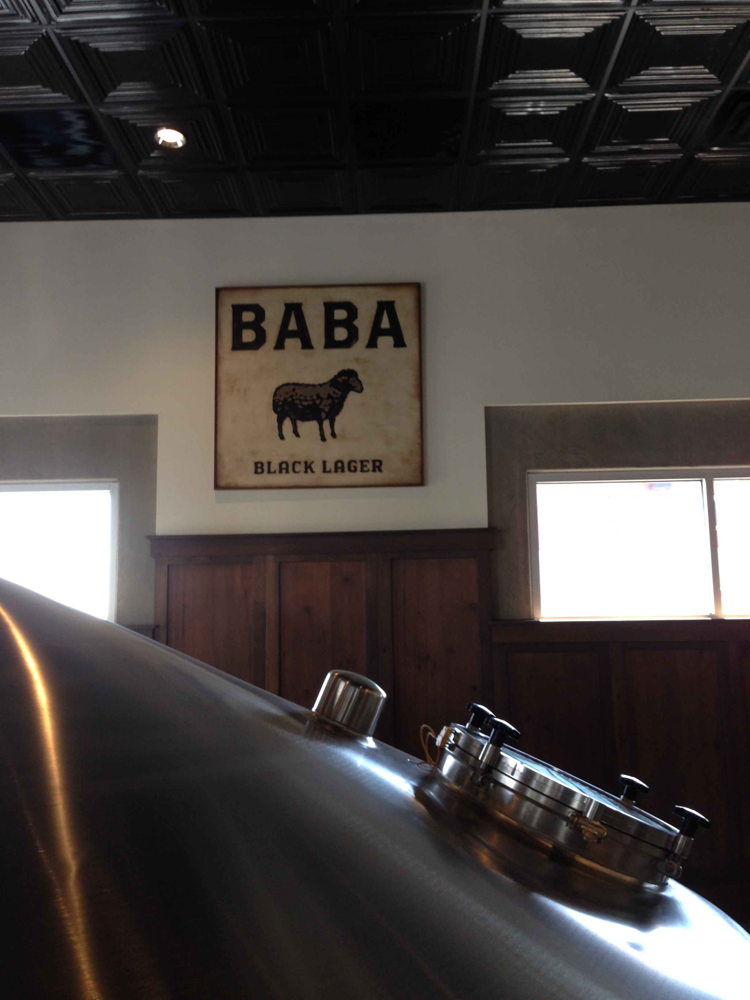

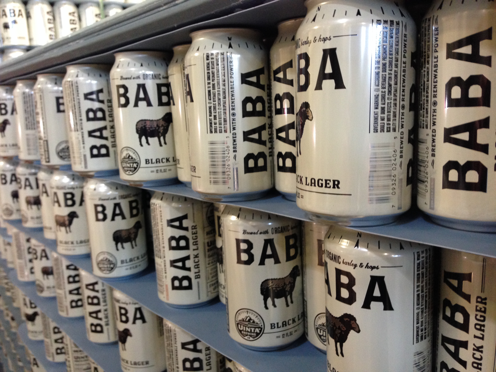

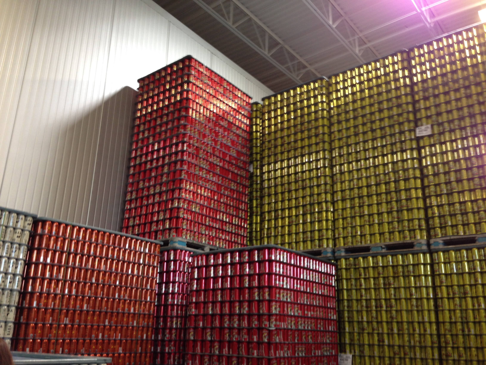
