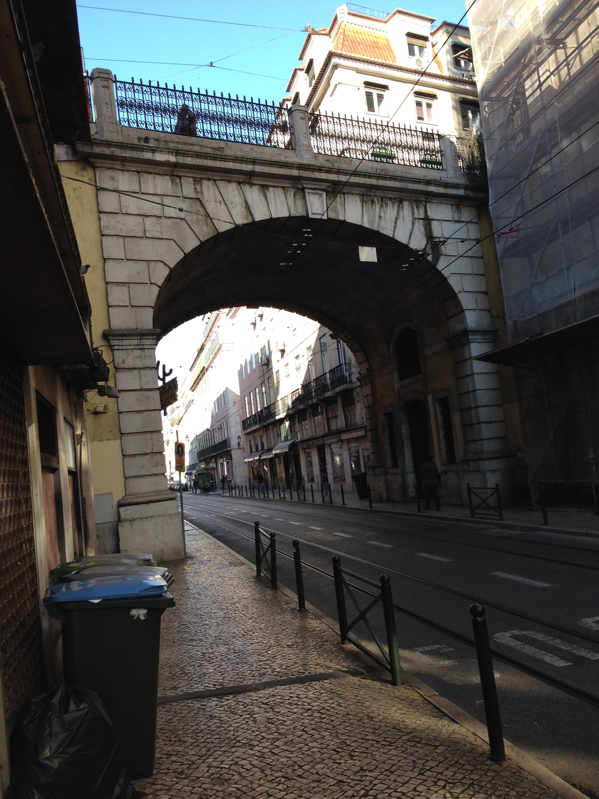

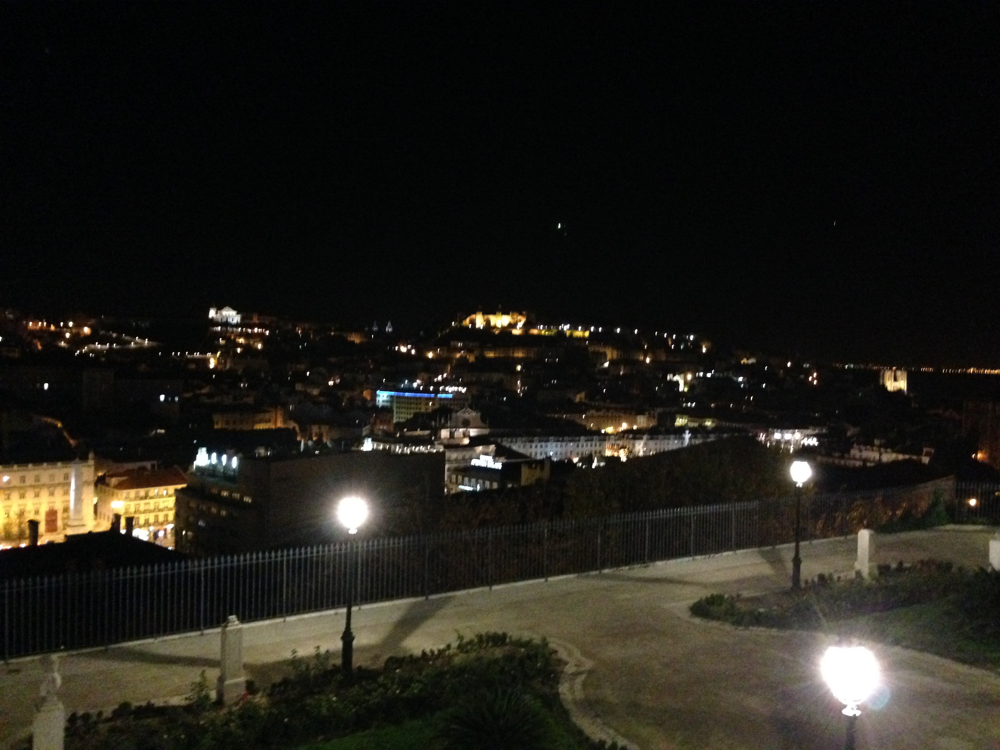

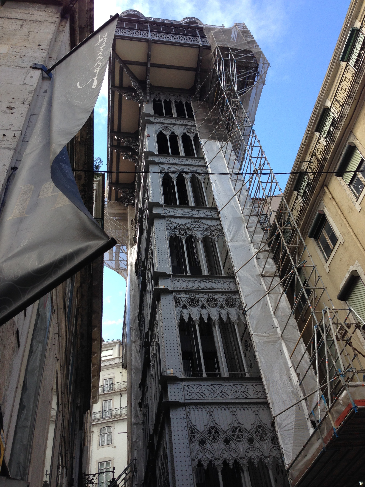

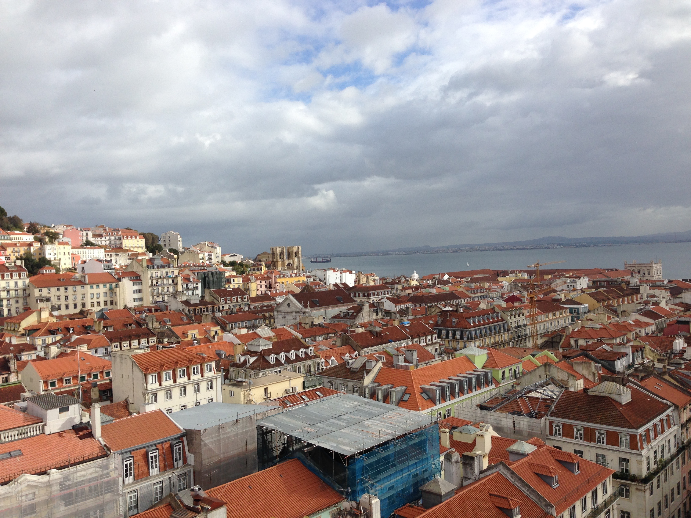

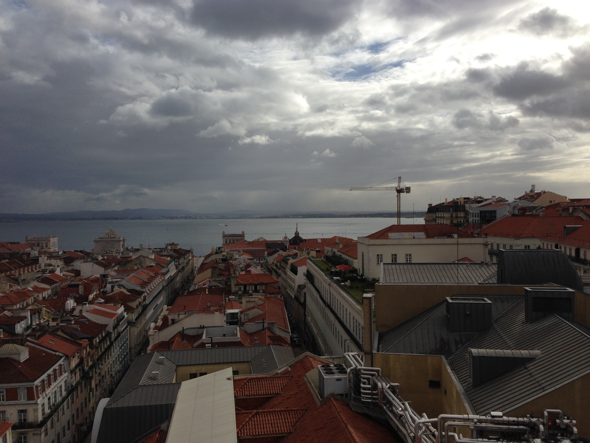

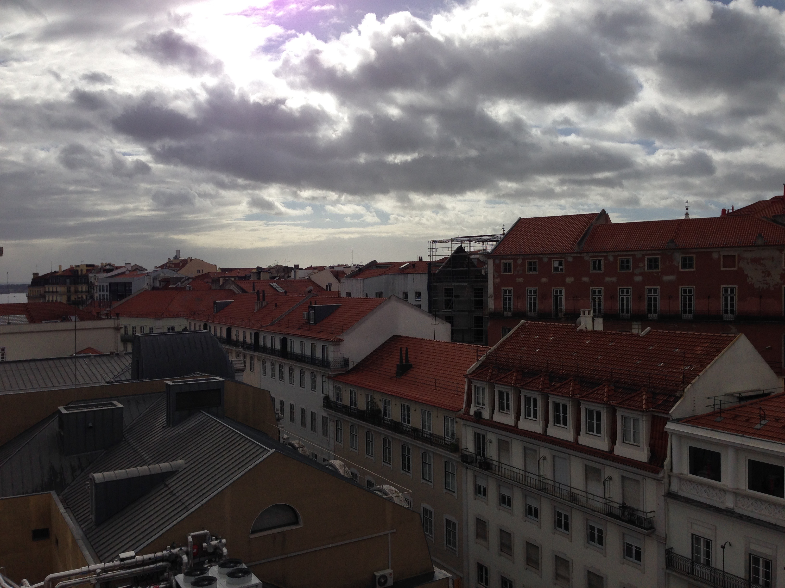

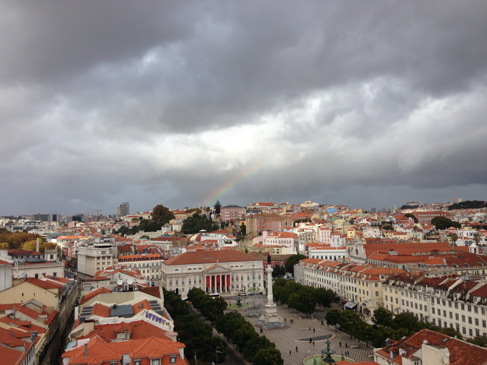

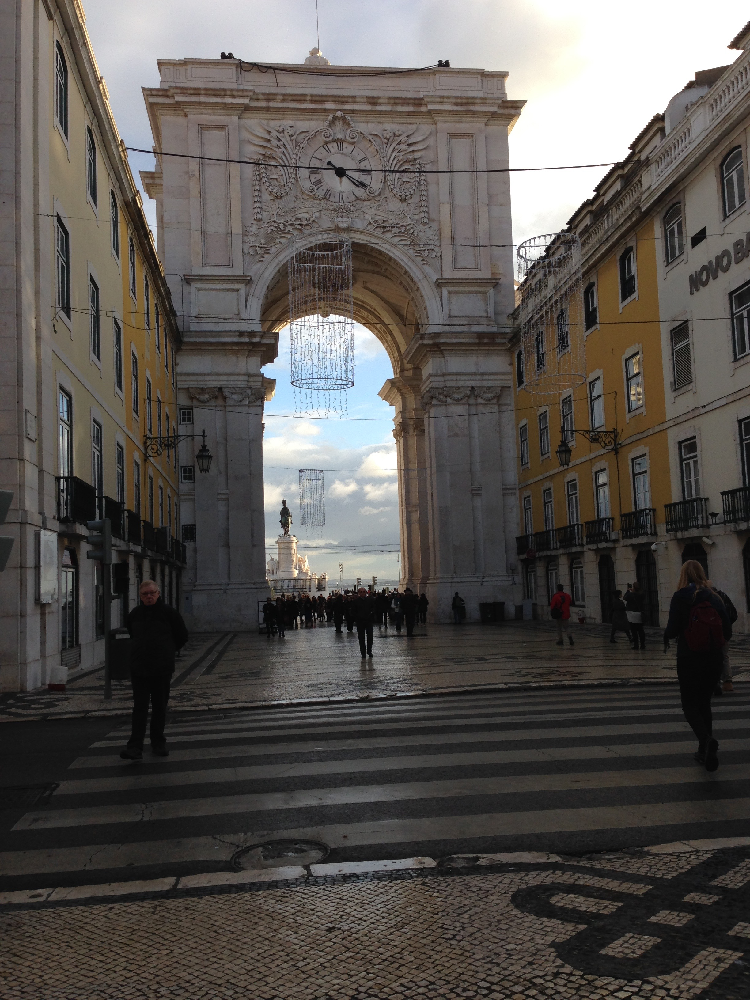

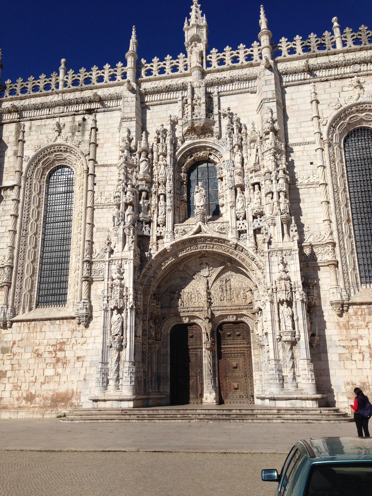

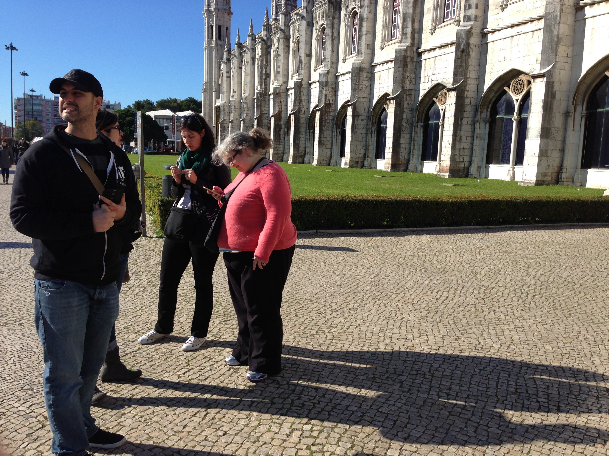

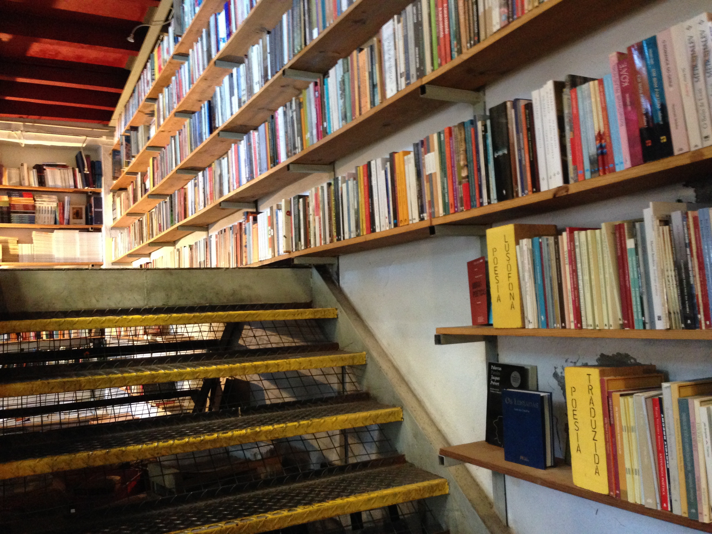

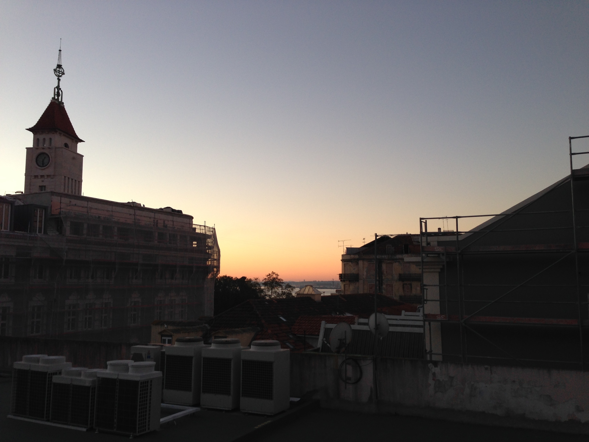

Last week, I met up with fellow Theme Wranglers, my team at Automattic, in Lisbon Portugal. We hacked on a cool, new project and talked a lot about themes. Here are a few shots from the trip.
