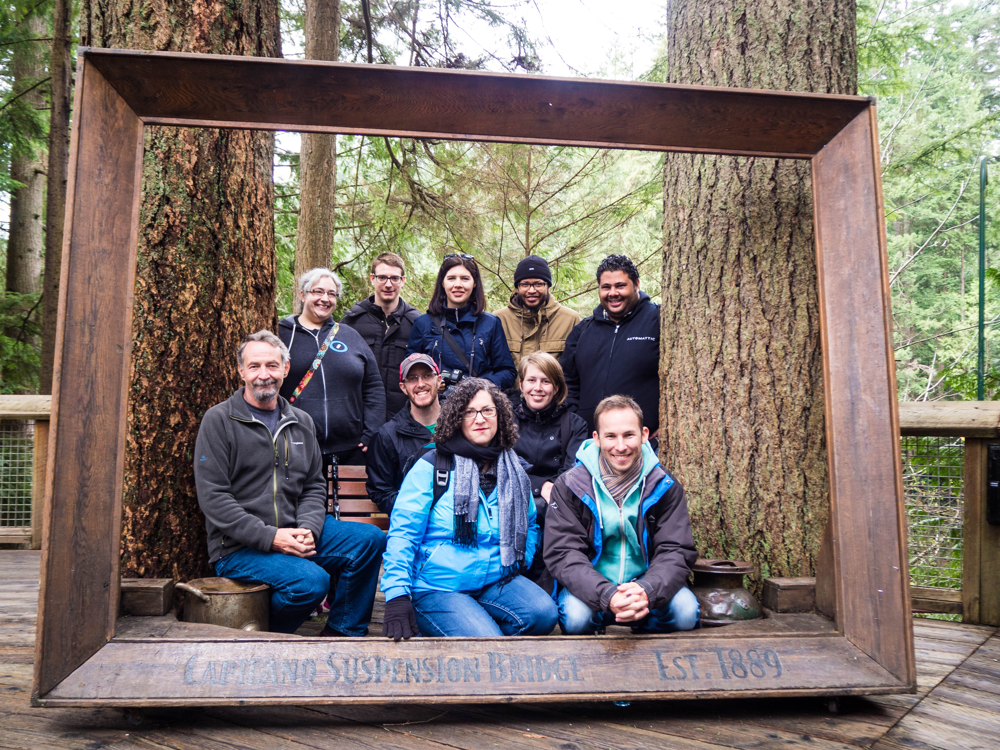

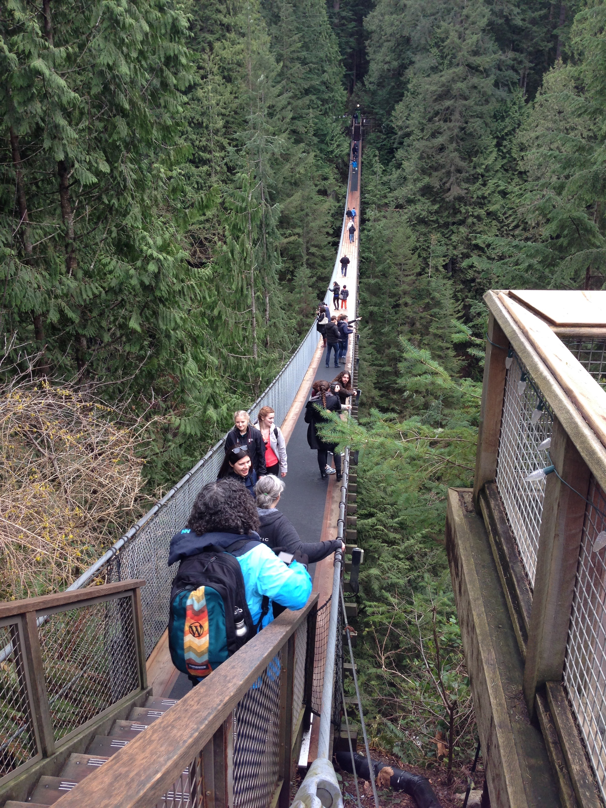

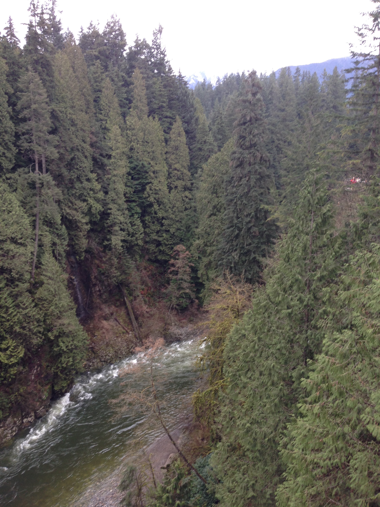

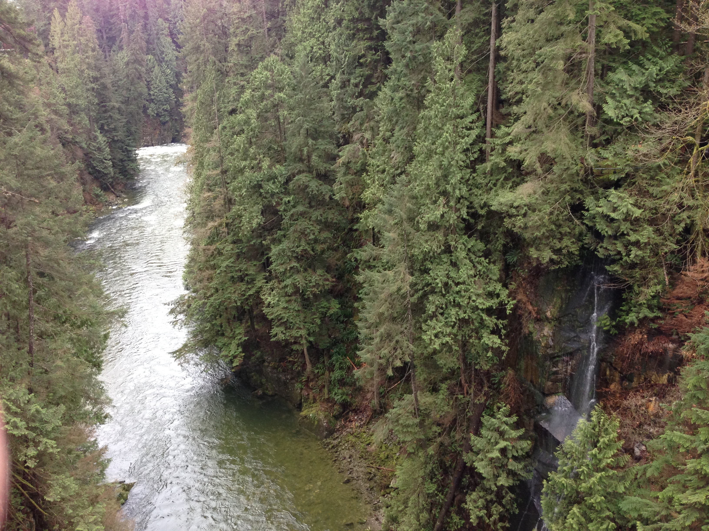

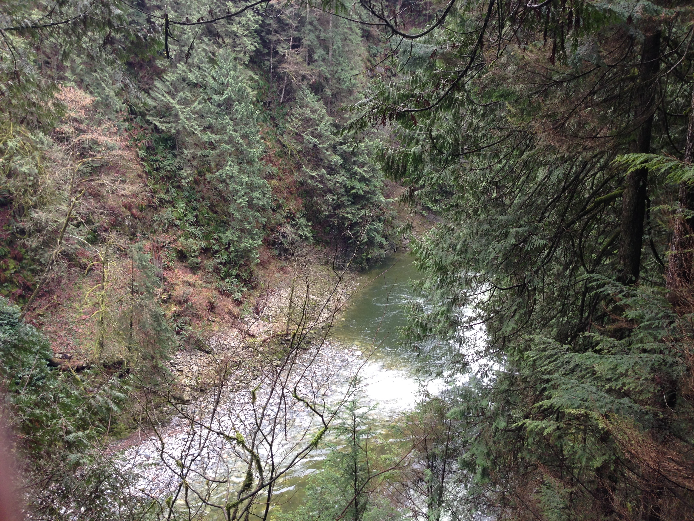

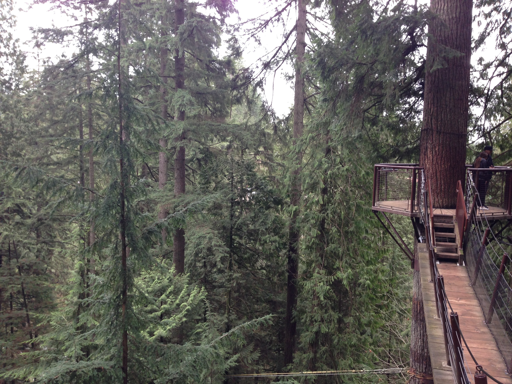

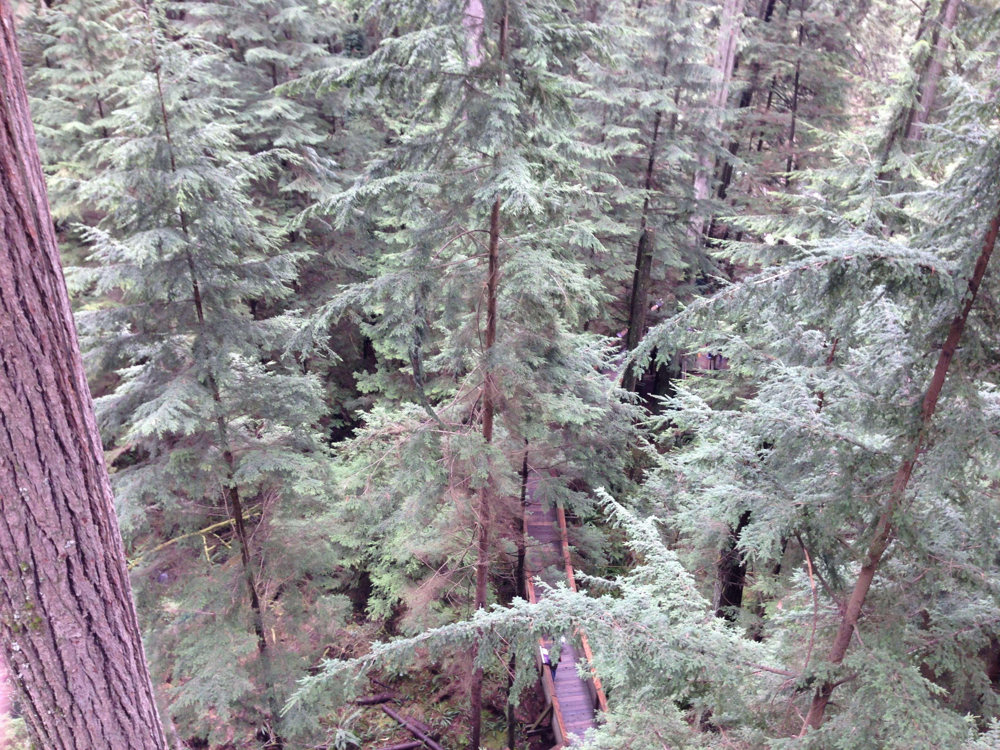

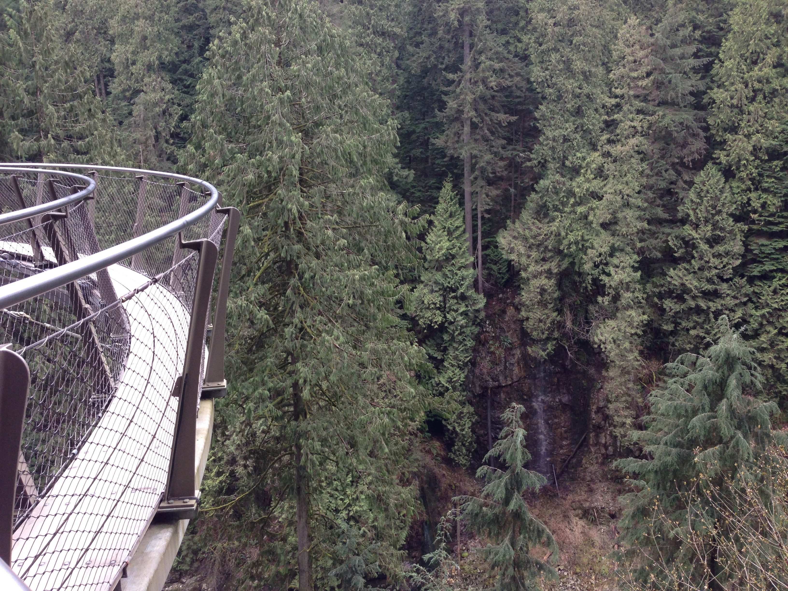

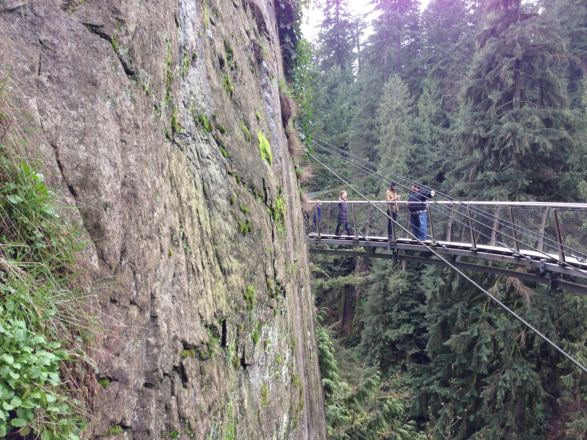

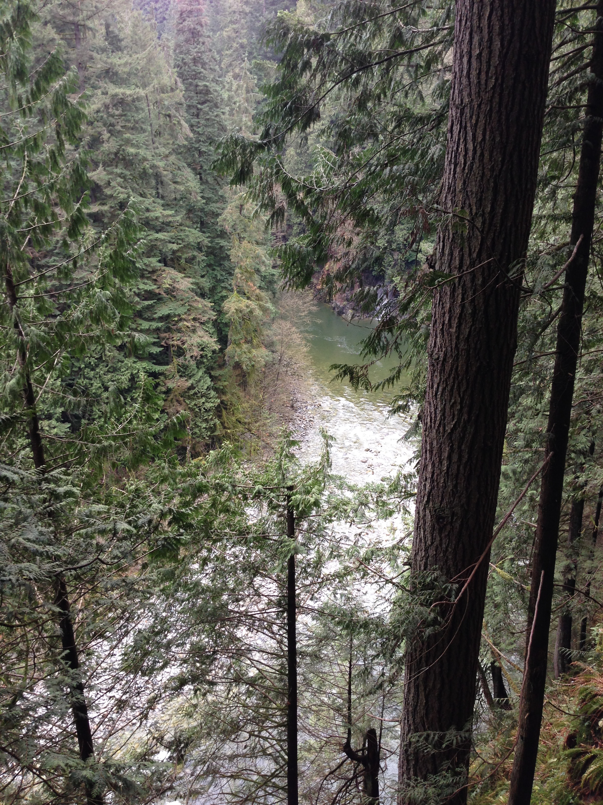

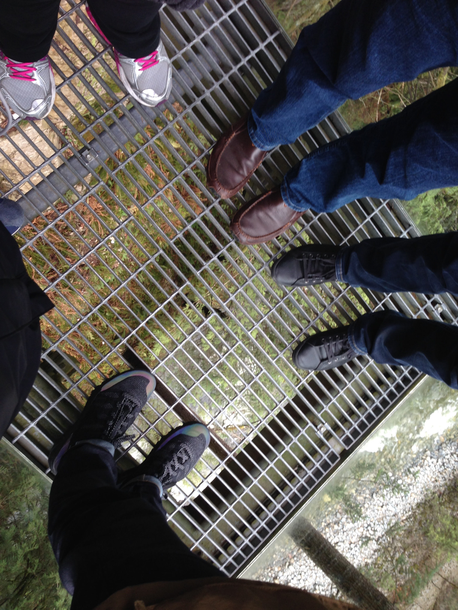

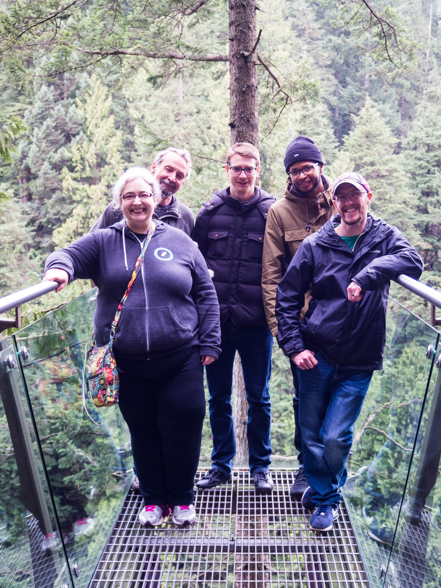

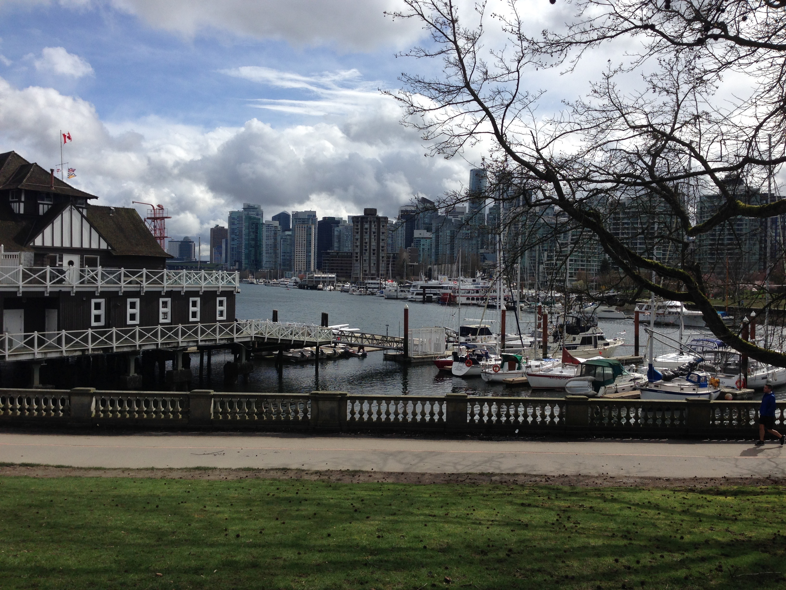

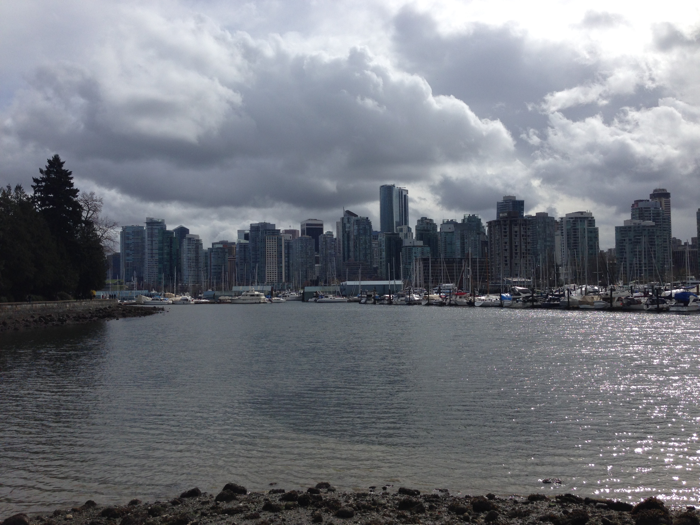

Last week, the Theme Team, my team at Automattic, spent the week in Vancouver. We worked on a [cool project](https://github.com/Automattic/theme-components), hung out and checked out [some sights](https://www.capbridge.com).
