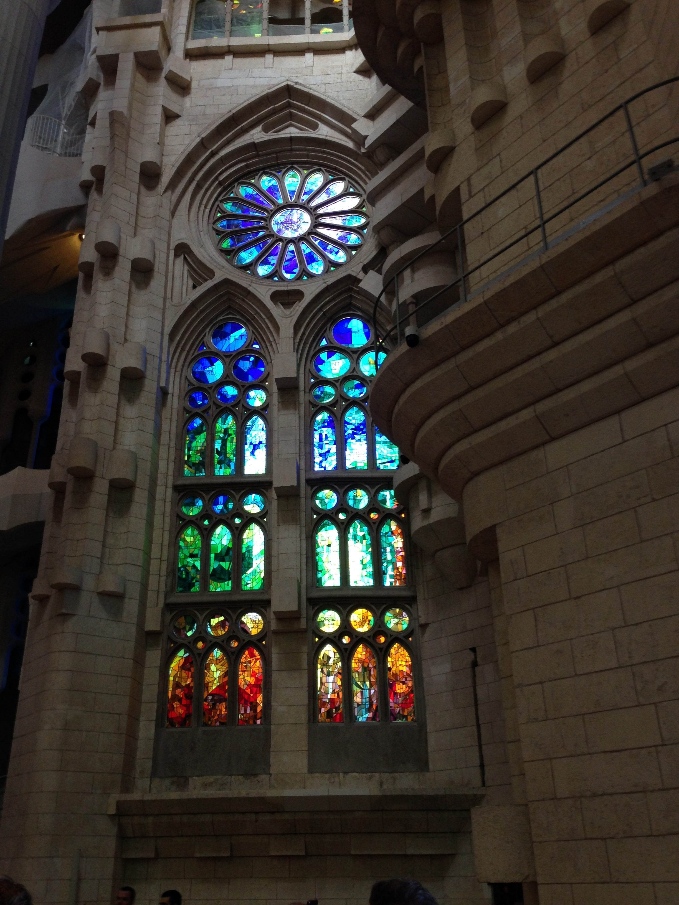
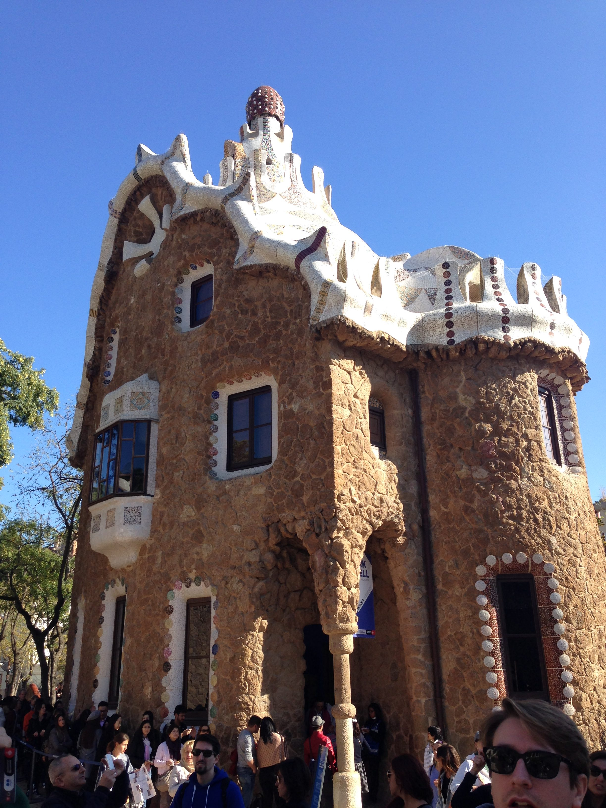

So I'm posting these photos late. 🙂 Last November the Theme Team, my team at Automattic, spent the week in Barcelona. We worked on [Components](http://components.underscores.me) and saw a few sites: La Sagrada Familia and Parc Güell.

