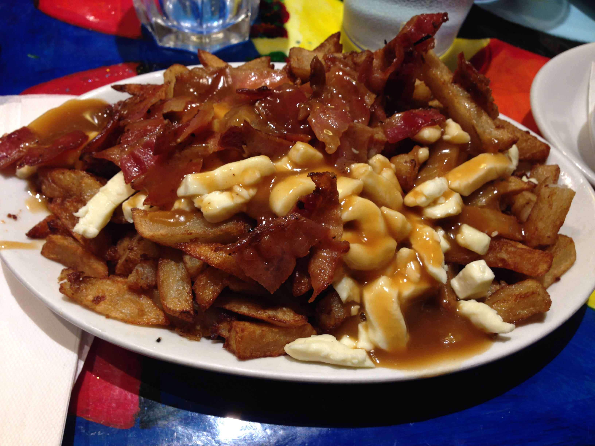
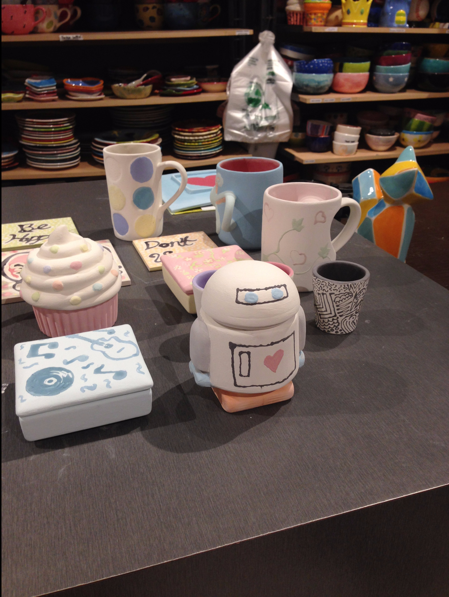
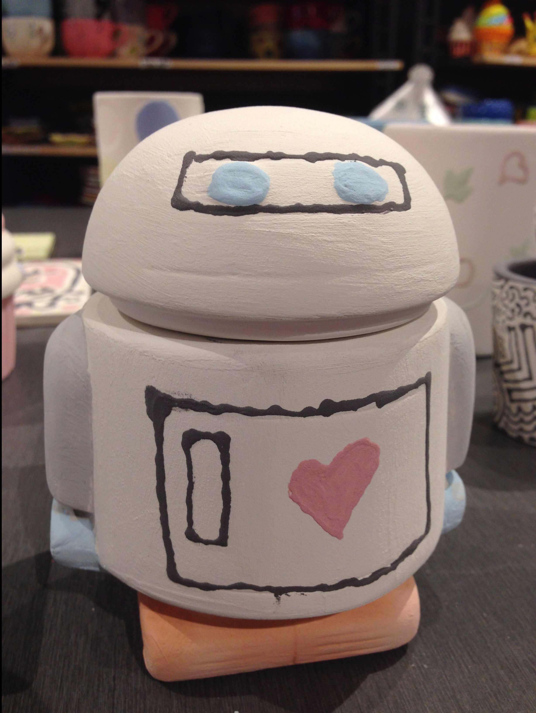
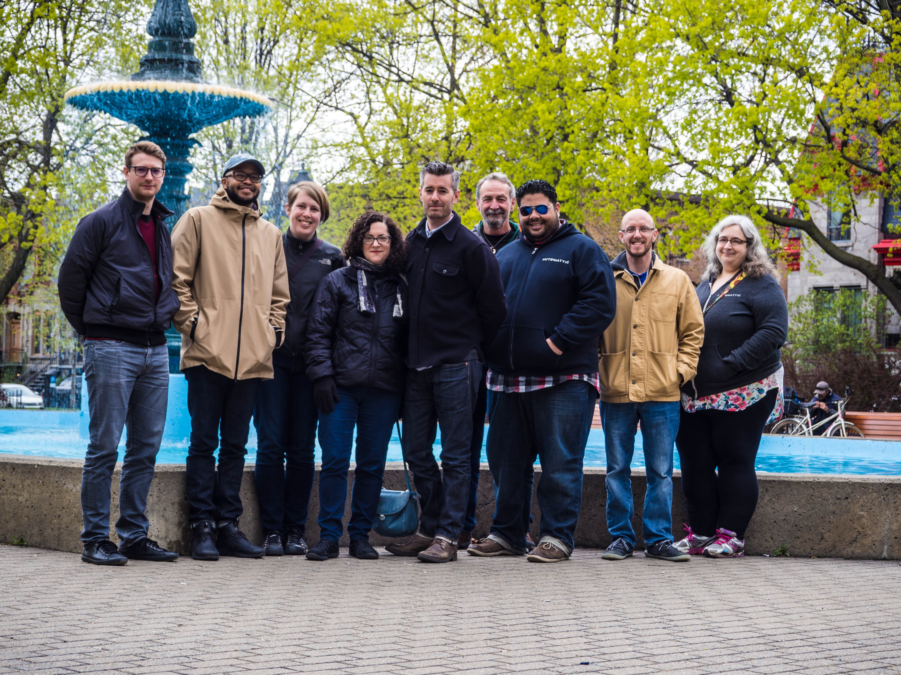
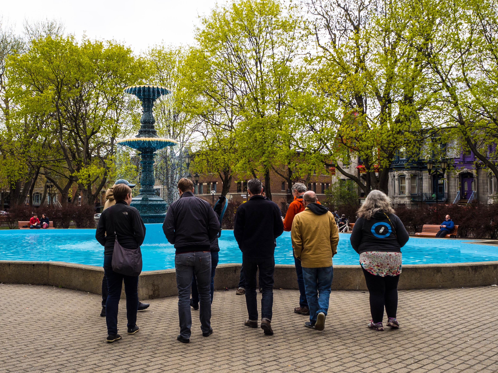
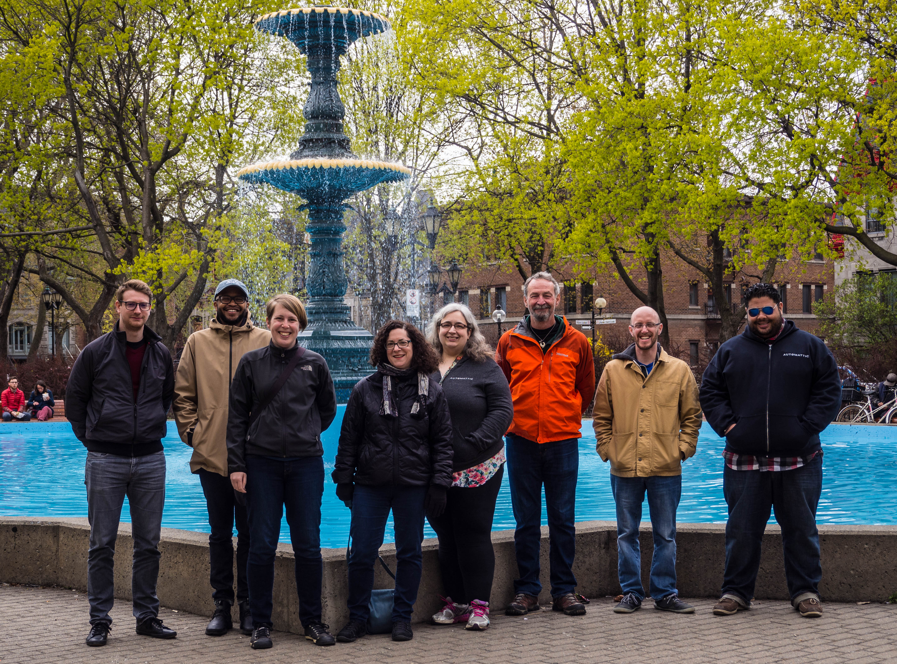

This past week, my team at Automattic – the Theme Team, met in Montréal for a week of work, planning for the future and team bonding. We worked hard, had fun and charted a path for the future of the team.

Sadly, I didn't take as many photos as I normally do. My phone started acting up. It turns out, its battery went bad. The entire phone became swollen and mostly inoperable. 🙁 But I did take a few.

I'm excited to get the projects we worked on launched soon. I'm more excited for the future of our team. It comes with some changes, but I think those will work out in the end.

We went to a few activities as a team, including a spoken story event, painting ceramics and more. As much as I love my work, I love my team even more.

