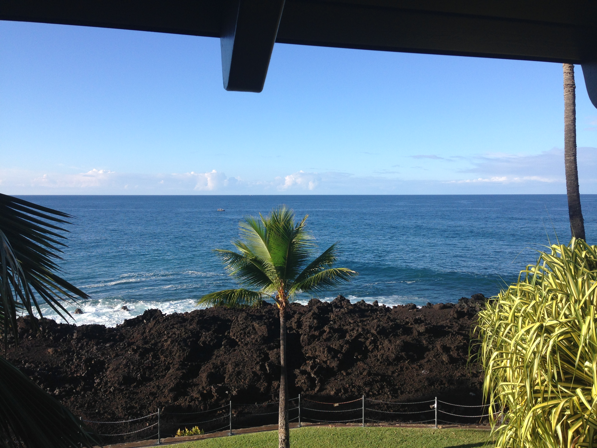
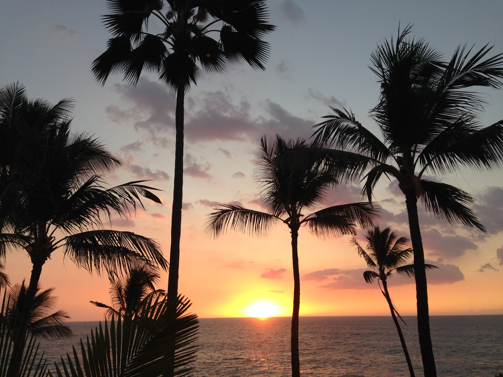
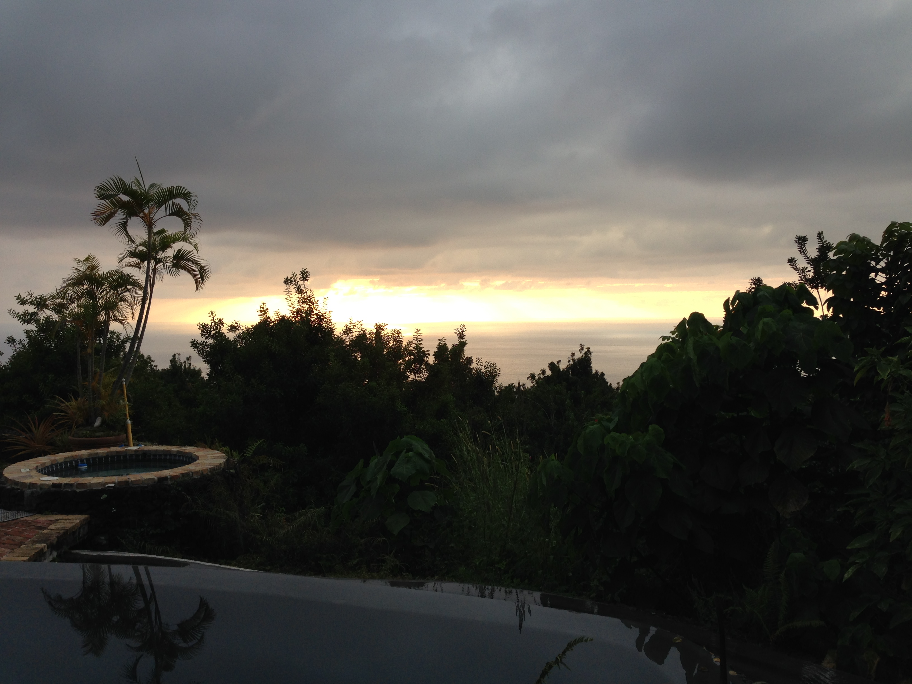
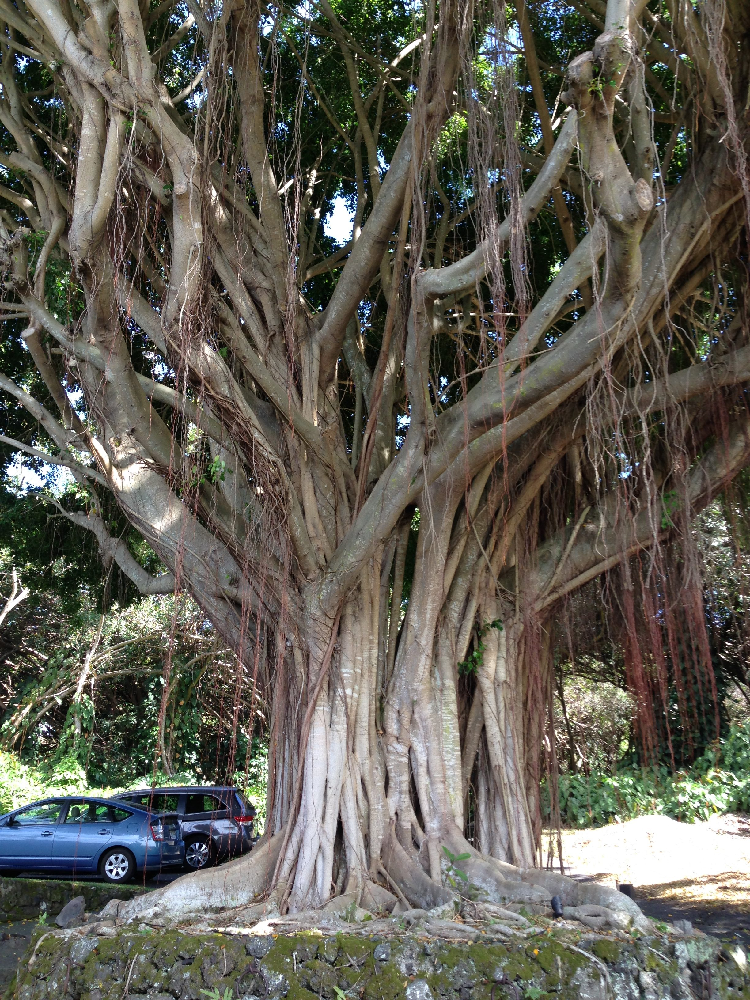
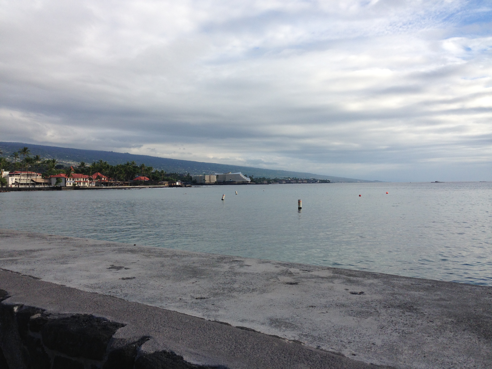

Who wouldn't like living and working in Hawaii for a week in December? Here are a few photos from a December, 2017 meetup in Kailua-Kona, Hawaii.

We [released a few themes](https://themeshaper.com/2018/02/15/styling-themes-for-gutenberg/) we created with Gutenberg in mind. This was my first meetup as team lead, and I had a blast exploring WordPress' new editing experience with my team.

