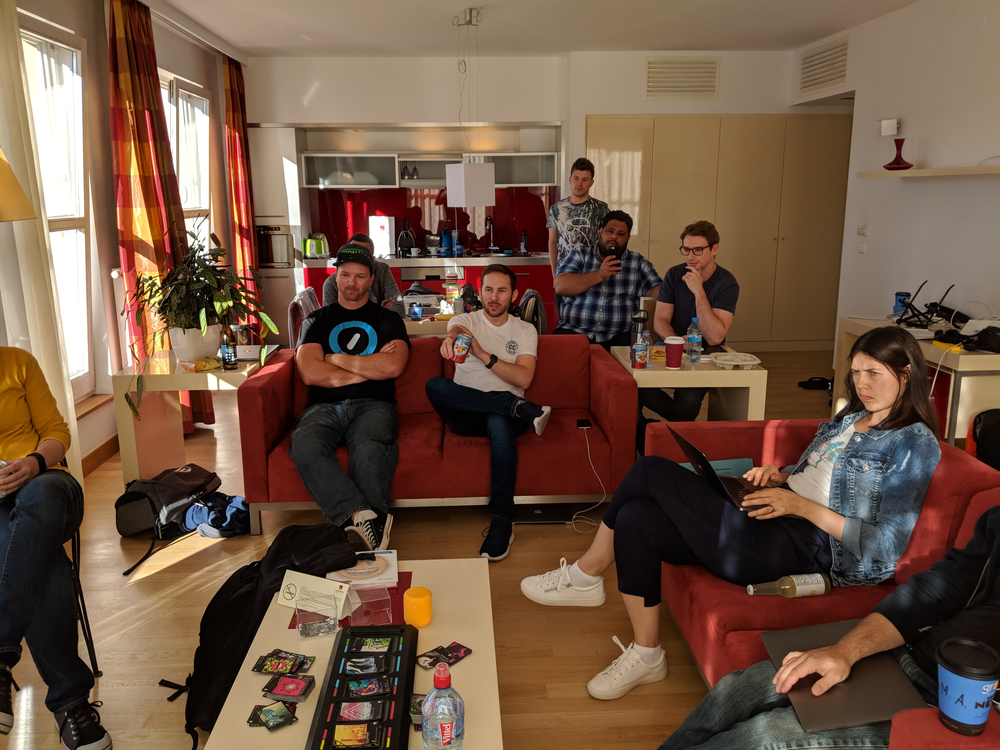
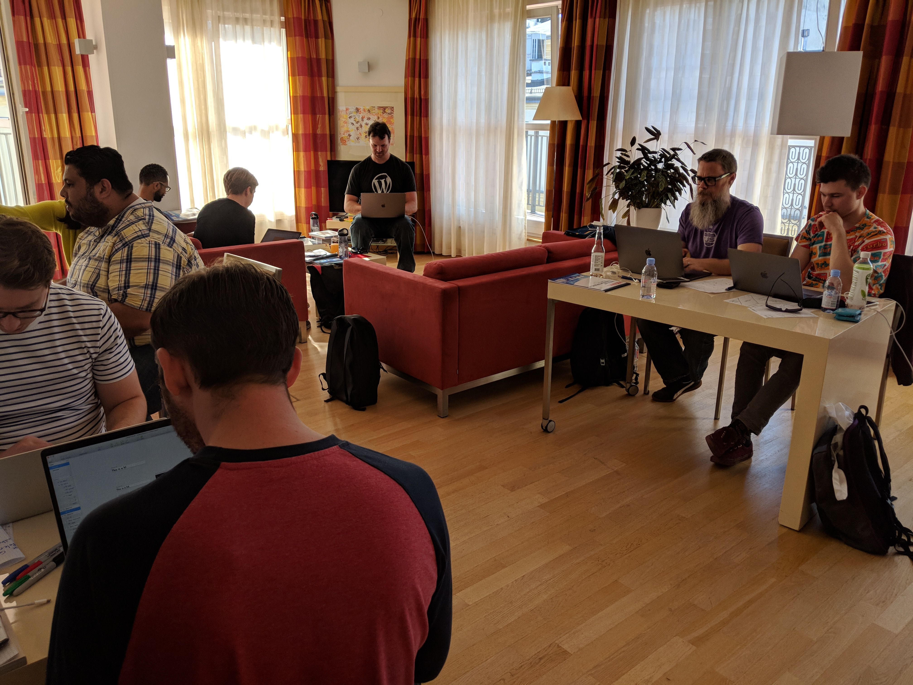
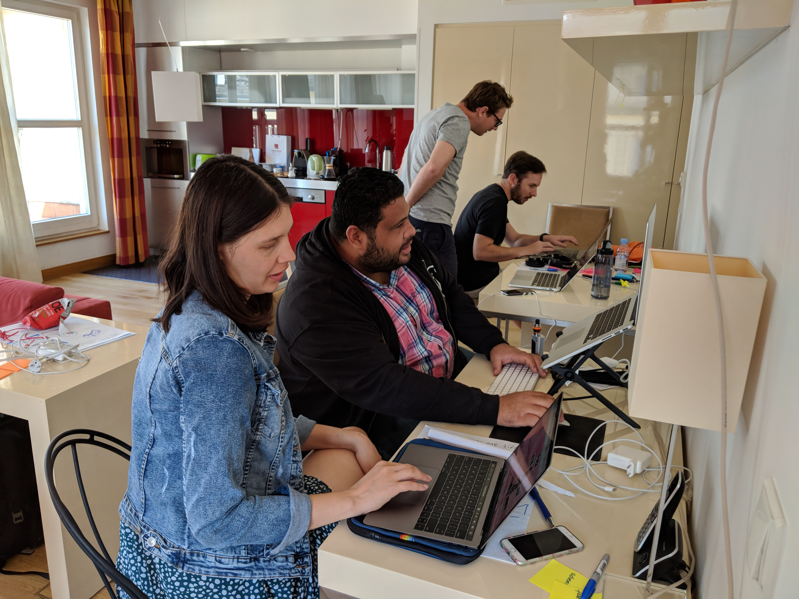
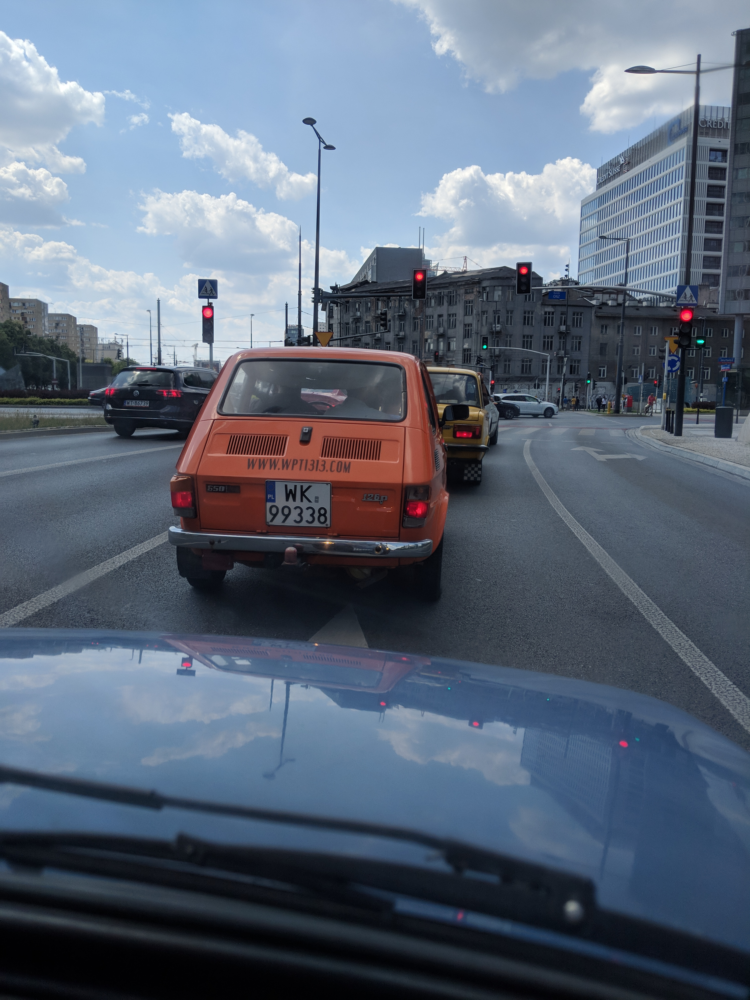

This one turned out to be my favorite meetup so far. Why? Because of the way the team worked together to be better at designing together.

Here are a few photos from a June, 2018 meetup in Warsaw, Poland.

