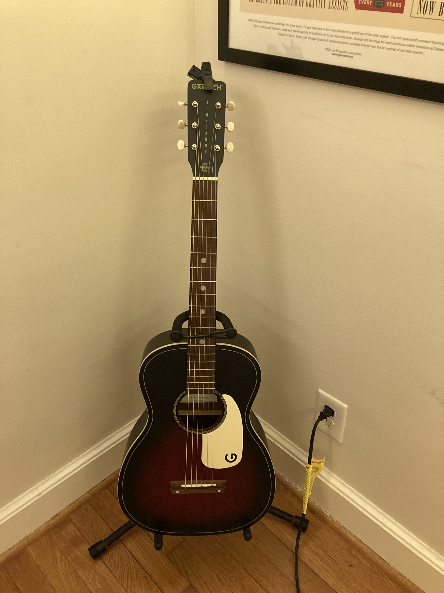

The year ticked over to 2026, and one newer constant has carried through for me: Playing guitar.

Yes, 2025 turned into a doozy for me, like many of you. Working in government last year meant dealing with a lot of changes and lack of information all at once. But I’m thankful to have a job and one that matters. My mom suffered a stroke, but has recovered quicker than we thought. I’m thankful she’s doing well. Both of my brothers made big moves. One across the country and the other across an ocean.

Through all that, I’ve shown up for guitar lessons each week and kept a decent practice routine. That routine hasn’t turned into a full song yet, but bits and pieces of many songs. Like _Sweet Home Alabama_, _Wonderwall_ and _Wish You Were Here_. I want to get there this year. It takes more practice. My best bet is a short song by Counting Crows called _Walkaways_.

I’ve wanted to learn guitar for years, even starting lessons in college. But I worked through school, so making the lessons and practicing fell in priority. A few years ago, I picked up this [Gretsch Jim Dandy Parlor](https://www.gretschguitars.com/gear/build/acoustic/jim-dandy-parlor/2711000535) acoustic guitar without even playing it. I liked the size, the look of it and its price. In videos of it, I dug the twangy sound. If I failed at learning guitar again, at least I wouldn’t be out a ton of money.

<figure></figure>

It sat for most of two years. Then I picked it up, trying to teach myself through YouTube. I learned here and there, but I wasn’t practicing enough. In late 2024, I decided to pay for lessons. My rationale? I always wanted to learn, and the regular lessons could provide the accountability I needed to practice more.

It worked! I may put the guitar in my hand for only 10 minutes some days, but that’s better than nothing. Sometimes, that 10 minutes leads to 20 or 30. My guitar teacher, Jay, pushes me while also granting me space to explore what I’m excited about.

After sticking with it for about a year, I decided to treat myself. New guitar! I wanted a full-size, solid-wood acoustic—something that I wanted to pick up every day, keep around for years to come and not want to put down. This time I played a lot of guitars to find the right one.

<figure></figure>

I landed on a [Martin Grand Performance Cutaway 11E](https://www.martinguitar.com/guitars/retired-models/GPC-11E.html). It felt better to me because of its smaller size, compared to a classic dreadnought shape. Plus, it still brought some big sound. I play it most days and reserve the Gretsch for travel or strumming while at my desk during work.

I dig playing guitar for a few reasons:

- It’s hard.
- It’s not a screen.
- You create something with your time.

If you need me, I’ll be practicing.
